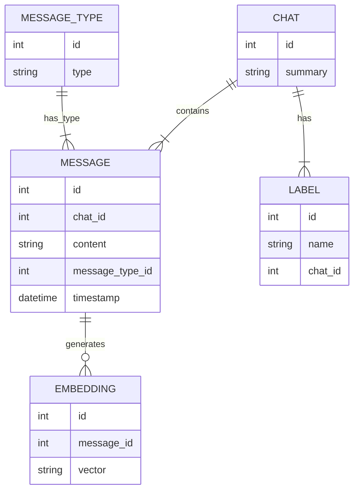

# ChatGPT API Backend

[](https://github.com/twolffpiggott/chatgpt-api-backend/actions/workflows/test.yml)

Backend for OpenAI/ChatGPT chats with database storage and API.



## Development

To install `chatgpt_api_backend` for development, run:

```bash
pip install -e '.[dev]'
```

Code for this repository is checked using [pre-commit](https://pre-commit.com/). After cloning this repository please run the following steps to initialise pre-commit:

```bash
pre-commit install --install-hooks
```

The following hooks are automatically run when new commits are made:

- From [pre-commit hooks](https://github.com/pre-commit/pre-commit-hooks):
    - end-of-file-fixer
    - trailing-whitespace
    - check-yaml
    - check-added-large-files (max. 500kb)
- [black](https://github.com/psf/black) Python code format checking
- [flake8](https://gitlab.com/pycqa/flake8) Python code linting
- [isort](https://github.com/PyCQA/isort) Python code import ordering
